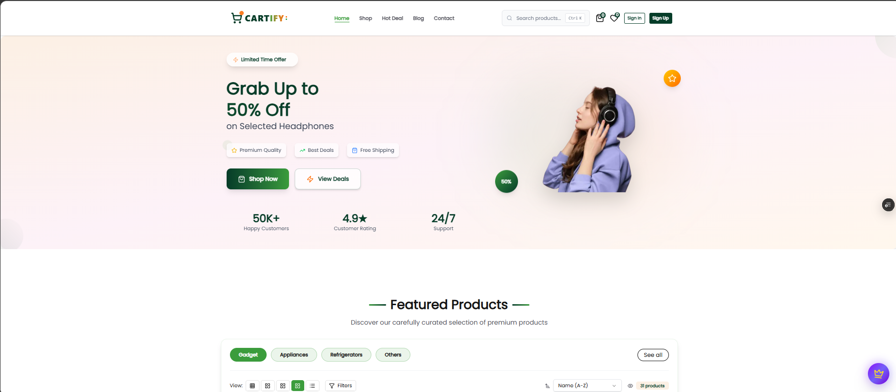
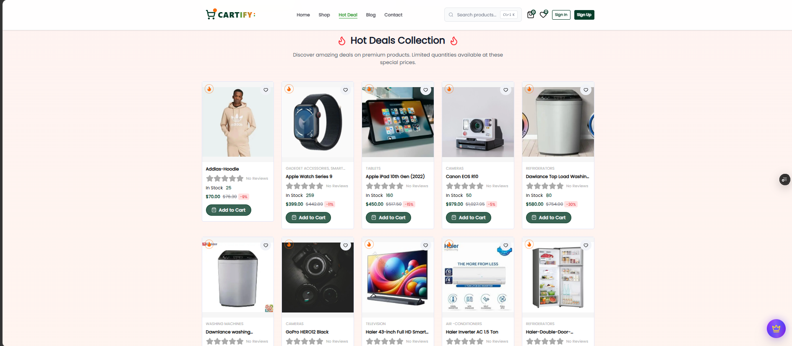
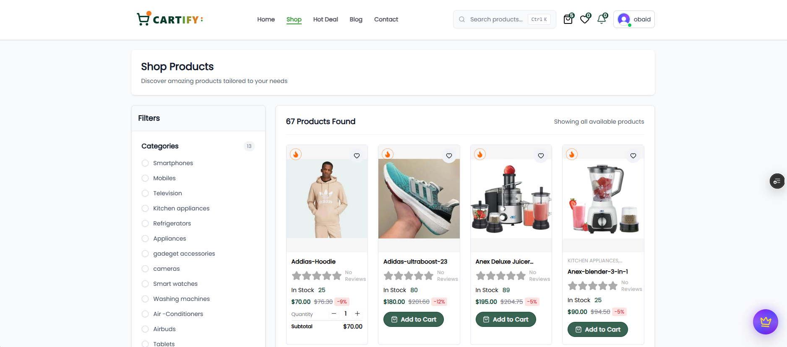

🛒 Cartify — Modern E-Commerce Platform

A full-stack e-commerce application built with Next.js, TypeScript, Sanity CMS, Clerk authentication, and Stripe payments, designed with a scalable and production-ready architecture.

✨ Overview

Cartify is a complete e-commerce system that includes product management, authentication, cart functionality, admin controls, and payment processing. It is built with performance, scalability, and real-world usage in mind.

## 📸 Screenshots

### 🏠 Home Page

### 🔥 Hot Deals Section

### 🛍️ Shop Page

🚀 Features

🛍️ Storefront
Product listing with categories & brands
Product detail pages
Search and filtering system
Shopping cart with persistence
Wishlist functionality
Fully responsive UI

👤 User System
Secure authentication (Clerk)
User profile management
Order history tracking
Checkout flow

💳 Payments
Stripe integration
Order confirmation system
Webhook handling

🧑‍💼 Admin Panel
Product management
Order management
User management
CMS-powered content (Sanity)

🧠 CMS
Dynamic product content
Category management
Image handling
Real-time updates

🧱 Tech Stack
Next.js (App Router)
React
TypeScript
Tailwind CSS
Sanity CMS
Clerk Authentication
Stripe API
Firebase (notifications)
Nodemailer (email service)

📁 Project Structure
app/            → Application routes
components/     → UI components
actions/        → Server actions
lib/            → Utilities
sanity/         → CMS setup
types/          → Type definitions
hooks/          → Custom hooks
public/         → Static assets

⚙️ Setup Instructions

1. Clone repository

git clone https://github.com/Obaidkorai-678/Cartify-Modern-E-Commerce-Platform
cd cartify

2. Install dependencies

npm install

3. Environment variables

Create a .env file:

NEXT_PUBLIC_BASE_URL=http://localhost:3000

# Sanity
NEXT_PUBLIC_SANITY_PROJECT_ID=
NEXT_PUBLIC_SANITY_DATASET=production
SANITY_API_TOKEN=

# Clerk
NEXT_PUBLIC_CLERK_PUBLISHABLE_KEY=
CLERK_SECRET_KEY=

# Stripe
NEXT_PUBLIC_STRIPE_PUBLISHABLE_KEY=
STRIPE_SECRET_KEY=

# Email
EMAIL_USER=
EMAIL_PASSWORD=
🏃 Run Project
npm run dev

Open:

http://localhost:3000

🌐 Routes
/ → Home
/shop → Products
/product/[slug] → Product page
/cart → Shopping cart
/checkout → Checkout
/admin → Admin dashboard
/studio → CMS
🚀 Deployment

Recommended stack:

Frontend → Vercel
CMS → Sanity
Auth → Clerk
Payments → Stripe
🔐 Security Notes

⚠️ Keep all secrets private:

API keys
Stripe secret key
Clerk secret key
Sanity tokens

Use .env locally and environment variables in production.

📌 Status
Active development
Production-ready structure
Scalable architecture

👨‍💻 Author

Built by Obaid Korai

GitHub: https://github.com/Obaidkorai-678

## 🚀 Live Demo

🔗 **[Visit Cartify Live Store](https://cartify-e-commerce-platform.vercel.app/)**

⭐ License

For educational and production use.
